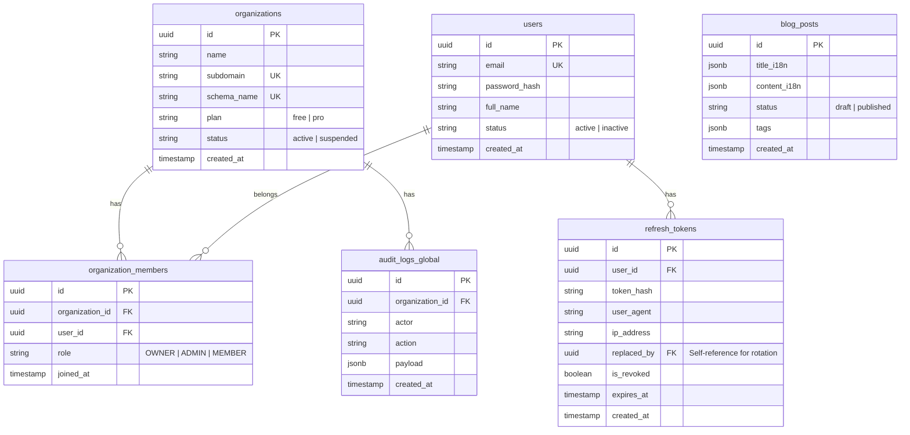
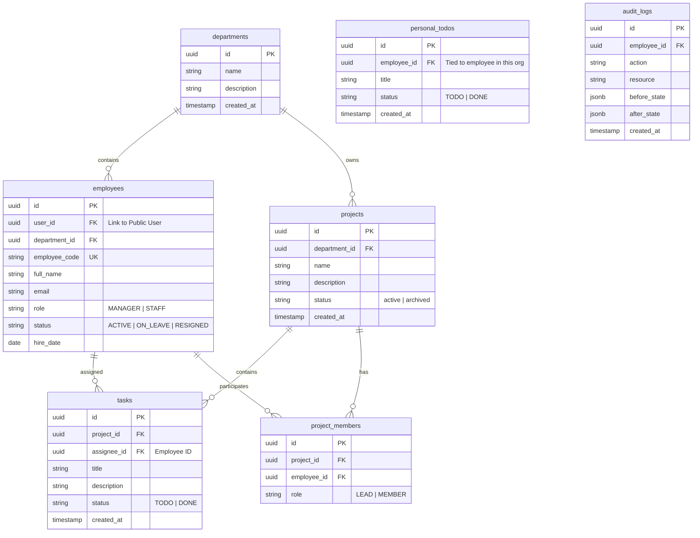

# Lean ERD Design — SaaS Platform (Multi-tenant with Multi-Org Support)

## 1. Kiến trúc lưu trữ (Multi-tenancy)
Hệ thống sử dụng mô hình **Separate Schema** trên PostgreSQL kết hợp với **Global User Registry**:

- **`public`**: Chứa dữ liệu hệ thống dùng chung (Organizations, Users, Roles, Global Audit).
- **`tenant_{id}`**: Chứa dữ liệu nghiệp vụ riêng của từng Organization (Projects, Departments, Tasks, Employees).

---

## 2. Public Schema (Shared Registry)

---

## 3. Tenant Schema (Isolated Workspace)

---

## 4. Key Changes for Multi-Org & Rotation
1.  **Global Users**: Bảng `users` được đưa ra `public` schema để một user có thể login một lần và chuyển đổi giữa các Organization mà họ tham gia.
2.  **Mapping Table**: `organization_members` quản lý quyền hạn của User trong từng Org (OWNER/ADMIN/MEMBER).
3.  **Department Layer**: Thêm bảng `departments` để phân cấp quản lý bên trong Organization.
4.  **Employee Context**: Dữ liệu nghiệp vụ (Projects, Tasks) giờ đây liên kết với `employees` thay vì trực tiếp với `users`, vì vai trò và vị trí của một người có thể khác nhau giữa các Org.
5.  **Token Rotation Ready**: Bảng `refresh_tokens` có trường `replaced_by` và `is_revoked` để hỗ trợ logic xoay vòng token an toàn.
