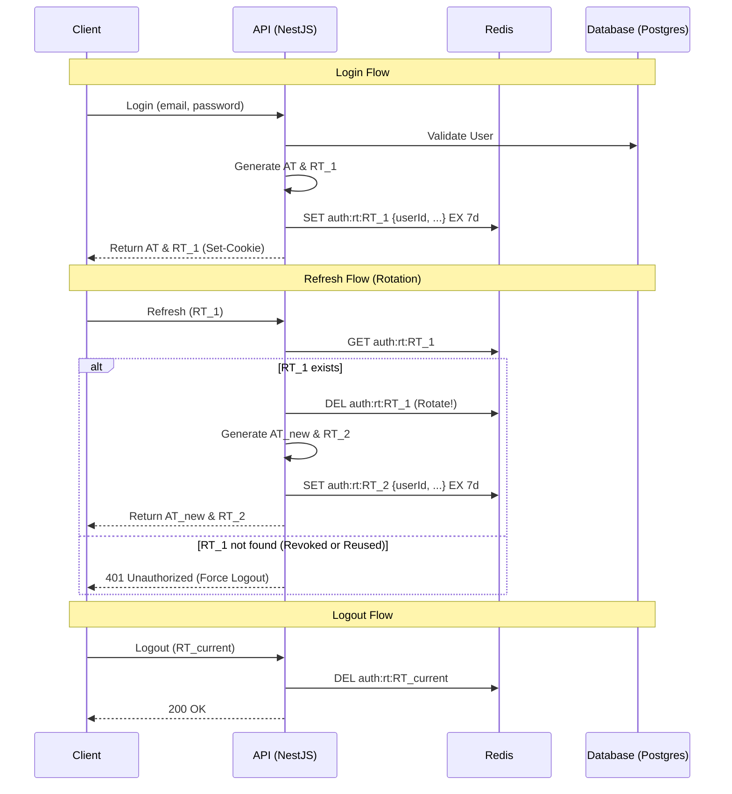

# Authentication & Authorization System

## 1. Overview

Hệ thống sử dụng cơ chế **Custom JWT Authentication** với chiến lược **Refresh Token Rotation** để đảm bảo bảo mật tối đa và trải nghiệm người dùng mượt mà trong mô hình Multi-tenant phức tạp (Organization -> Department).

## 2. Token Strategy

### 2.1 Access Token (AT)

- **Thời hạn**: Ngắn (15 - 30 phút).
- **Lưu trữ**: Memory (Frontend state).
- **Payload**:
  ```json
  {
    "sub": "user_uuid",
    "email": "user@example.com",
    "orgId": "org_uuid (optional)",
    "schemaName": "tenant_schema_name (optional)",
    "role": "OWNER/ADMIN/MEMBER",
    "type": "initial | contextual",
    "iat": 123456789,
    "exp": 123456789
  }
  ```

### 2.2 Refresh Token (RT)

- **Thời hạn**: Dài (7 ngày).
- **Lưu trữ**: 
  - **Client**: HttpOnly Cookie (Bảo mật nhất) hoặc Secure Storage.
  - **Server**: **Redis** (Tăng tốc độ truy vấn và hỗ trợ thu hồi tức thì).
- **Cơ chế Rotation**: Mỗi khi AT được refresh, một cặp AT và RT mới sẽ được cấp phát, và RT cũ sẽ bị vô hiệu hóa ngay lập tức.

## 3. Auth Flow with Redis & Rotation



## 4. Redis Key Schema

| Key | Type | Description | TTL |
| :--- | :--- | :--- | :--- |
| `auth:rt:{token}` | String | Lưu thông tin phiên làm việc gắn với Refresh Token | 7 days |
| `auth:user:{userId}:tokens` | Set | (Optional) Danh sách các RT active của một user để hỗ trợ Logout All | 7 days |

## 5. Security Benefits

1. **Vô hiệu hóa tức thì**: Nếu phát hiện rò rỉ, chỉ cần xóa key trong Redis.
2. **Phát hiện tấn công phát lại (Replay Attack)**: Nếu một RT cũ đã bị xoay vòng (rotated) được sử dụng lại, hệ thống sẽ không tìm thấy trong Redis và yêu cầu đăng nhập lại.
3. **Hiệu suất cao**: Kiểm tra session trong Redis nhanh hơn nhiều so với truy vấn Database truyền thống.

## 6. Multi-tenant Auth Flow

### 6.1 Signup Flow (Bắt đầu hành trình SaaS)

Quy trình đăng ký được thiết kế để hỗ trợ việc tự phục vụ (Self-service) cho các Manager:

1.  **Dữ liệu đầu vào**: User cung cấp `fullName`, `email`, `password`, `role` ('manager' | 'user') và `organizationName`.
2.  **Xử lý (Atomic Transaction)**:
    - Tạo **User** trong bảng public.
    - Nếu là **Manager**:
        - Tự động sinh `subdomain` và `schema_name` từ Tên tổ chức.
        - Tạo **Organization** record.
        - Tạo **Membership** liên kết User với Org với quyền `OWNER`.
        - **Khởi tạo Database Schema**: Thực thi lệnh `CREATE SCHEMA` vật lý trên Neon Postgres.
3.  **Kết quả**: Trả về AT, RT và danh sách Organizations mà user vừa tham gia.

### 6.2 Login & Context Selection

1.  **Bước 1: Login**: Người dùng đăng nhập bằng Email/Password.
    - Cấp AT cơ bản (type: `initial`).
    - Trả về danh sách `organizations` (id, name, role).
2.  **Bước 2: Select Organization**: Người dùng chọn Org muốn làm việc.
    - Gọi endpoint `/auth/select-org`.
    - Hệ thống kiểm tra quyền thành viên.
    - Cấp lại AT mới (type: `contextual`) có chứa `orgId` và `schemaName`.
    - Token này sẽ được dùng để truy cập dữ liệu trong schema riêng biệt của Tenant.

## 4. Technical Architecture

### 4.1 Backend (NestJS)

- **AuthService**: Sử dụng `db.transaction` (WebSocket Pool) để đảm bảo tính toàn vẹn khi tạo Org/User/Schema.
- **Slugify Utility**: Đảm bảo `subdomain` và `schema_name` luôn hợp lệ về mặt kỹ thuật.
- **Physical Isolation**: Mỗi Organization có một Postgres Schema riêng biệt, được khởi tạo ngay lúc Signup.

### 4.2 Database (Neon Postgres)

- **Public Schema**: Chứa User, Organization metadata, Membership, Refresh Tokens.
- **Tenant Schemas**: Chứa dữ liệu vận hành (Department, Employee, Project...) riêng biệt cho từng khách hàng.

## 5. Security Progress

- [x] Mật khẩu được hash bằng **BCrypt**.
- [x] Refresh Token Rotation logic.
- [x] Physical Schema Isolation tại tầng Database.
- [ ] Implement Rate Limiting.
- [ ] Audit Log cho Security Events.
